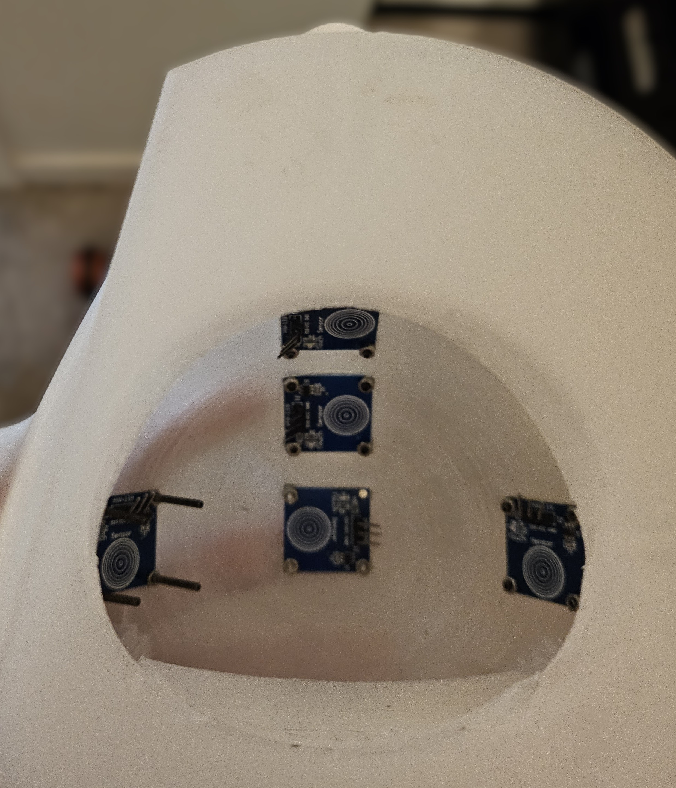

# Project-BoRider-Capacitive-Touch-Mechatronic-Platform

## System Overview
BoRider is an instructional robotic mechatronics platform engineered for the cognitive development of children aged 6 to 24 months. The vehicle is guided by capacitive touch inputs mapped directly to directional motor outputs. Strict hardware constraints required all exterior surfaces to remain entirely smooth, with a total form factor under 30 inches (76cm).


## Hardware Architecture
* **Microcontroller:** Raspberry Pi
* **Sensor Array:** 5x HiLetgo TTP223B Capacitive Touch Switch Modules
* **Actuation:** DC Motor Kits (PWM controlled)
* **Visual Subsystem:** 60-pixel NeoPixel Addressable LED Strip
* **Chassis:** Custom 3D-printed design. Core components (axle, gears, tires) printed in standard PLA. Exterior shell printed in transparent PLA to diffuse internal LEDs. Conductive PLA integrated for localized touch points. 



## Software Stack
The system is built entirely in Python 3, utilizing a distributed multi-processing architecture to prevent blocking execution during simultaneous I/O tasks.
* `RPi.GPIO` for direct sensor telemetry.
* `pwmio` for variable motor actuation.
* `multiprocessing` for isolated LED routing and background audio daemon management.
* `subprocess` for non-blocking single-shot sound effect triggers.

### Operational Modes
1. **Manual Mode (Implemented):** Localized capacitive touch inputs route directly to motor drivers.
2. **Instructional Mode (Planned):** Sequenced memory state requiring specific directional combinations (e.g., left, left, right, forward).
3. **Catch-Me Mode (Planned):** Evasion state utilizing onboard sensors to detect motion and autonomously navigate away from the target.
Note: Instructional and Catch-Me modes were fully scoped for the control logic but remained pending implementation prior to the catastrophic hardware failure.

## Post-Mortem & Failure Analysis
During initial prototyping, the system achieved full operational status in Manual Mode. The TTP223B sensors successfully registered inputs through the transparent PLA, successfully mapping logic to the DC motor array and triggering the audio/visual subsystems.

During live-fire stress testing, a 3D-printed drive gear on the main axle began slipping under load. While conducting live electrical troubleshooting to diagnose this mechanical failure, an accidental crossing of the positive and negative power rails caused a catastrophic short circuit, resulting in a complete hardware failure of the prototype board. 

**Engineering Takeaway:** Prototyping electromechanical drivetrains requires strict adherence to fused power distribution and reverse-polarity protection, even during rapid iteration cycles.

## Dependencies
Ensure the following libraries are installed on the target environment:
```bash
pip3 install RPi.GPIO adafruit-circuitpython-neopixel adafruit-blinka
```
*(Note: Audio requires the native Linux `aplay` package)*
